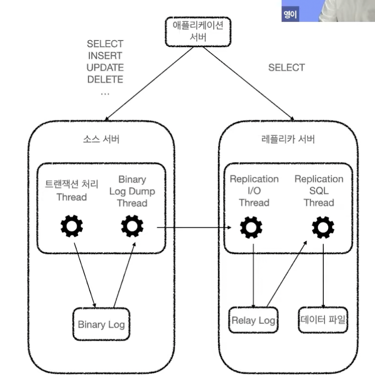
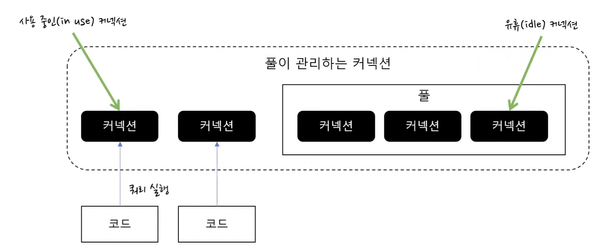

# 데이터베이스 다중화, 캐시, CDN, DB Lock

## 데이터베이스 다중화를 하여 부담을 줄이자

### 목적

- 대부분의 어플리케이션은 쓰기 연산보다 읽기 연산의 요청 비율이 높은 편
- 읽기 연산의 성능을 높이기 위해 쓰기/읽기 역할로 서버를 분리하여 트래픽 분산

### 개념


- 주 데이터베이스 (Master)
    - 쓰기 연산 지원 (insert, update, delete)
    - select 를 지원하기도 함
- 부 데이터베이스 (Slave)
    - 주 데이터베이스로부터 사본 데이터를 전달 받아 관리
    - 읽기 연산 지원 (select)

### 스프링에서의 데이터베이스 다중화 구현

- 데이터 소스(DataSource)를 하나만 사용하는 경우 스프링이 자동으로 데이터 소스 생성

    ```yaml
    spring:
      datasource:
        url: jdbc:mysql://127.0.0.1:3306/kotlin_spring?serverTimezone=UTC
        driver-class-name: com.mysql.cj.jdbc.Driver
        username: root
        password: 1234
    ```

- 두 개 이상의 데이터 소스 사용 시 자동으로 생성하지 않기 때문에 별도 처리 필요
    - 등록한 데이터 소스에 대한 Bean 을 수동으로 등록
    - Spring 의 Transactional 어노테이션 readOnly 옵션에 따라 어느 데이터 소스를 사용할지 지정

    ```yaml
    spring:
      datasource:
        master:
          hikari:
            driver-class-name: com.mysql.cj.jdbc.Driver
            jdbc-url: jdbc:mysql://127.0.0.1:3306/multiple-datesource?serverTimezone=UTC
            read-only: false
            username: root
            password: 1234
    
        slave_1:
          hikari:
            driver-class-name: com.mysql.cj.jdbc.Driver
            jdbc-url: jdbc:mysql://127.0.0.1:3306/multiple-datesource?serverTimezone=UTC
            read-only: true
            username: root
            password: 1234
    ```


### DB Replication 관련 테코톡 영상

- [https://www.youtube.com/watch?v=95bnLnIxyWI&ab_channel=우아한테크](https://www.youtube.com/watch?v=95bnLnIxyWI&ab_channel=%EC%9A%B0%EC%95%84%ED%95%9C%ED%85%8C%ED%81%AC)
- Replication 을 적용하는 목적
  - 스케일 아웃 (서버 성능 높이기)
  - 데이터 백업
  - 데이터 분석
    - 분석용 쿼리의 경우 대량의 데이터를 다루기 때문에 쿼리 자체가 무거운 편
    - 레플리카 서버를 분석용 서버로 사용
  - 데이터의 지리적 분산
    - 지리적으로 가까운 위치에 데이터베이스 서버를 위치하여, 응답 속도 개선
- 복제
  - 바이너리 로그 : MySQL 서버에서 발생하는 모든 변경사항을 별도의 로그 파일에 순서대로 저장
    - 데이터의 변경 내역
    - 데이터베이스나 테이블의 구조 변경
    - 계정이나 권한의 변경 정보
  - 복제 과정 (데이터 동기화)
    - 소스 서버에서 생성된 바이너리 로그를 레플리카 서버로 전송
    - 레플리카 서버의 로컬 디스크에 저장
    - 레플리카 서버의 MySQL 서버에 반영
  - 복제를 돕는 3개의 스레드
    - Binary Log Dump Thread
      - Binary Log 를 레플리카 서버로 전송
      - 레플리카 서버가 소스 서버에 연결되면 소스 서버 내부에 Binary Log Dump Thread 생성
    - Replication I/O Thread
      - Binary Log Event 를 가져와 로컬 서버의 파일(Relay Log)로 저장
      - Relay Log : 바이너리 로그 이벤트를 레플리카 로컬 서버에 파일 형태로 저장한 것
      - Life Cycle : 복제가 시작되면 생성되며, 종료되면 제거됨
    - Replication SQL Thread
      - Relay Log 파일을 읽고 실행

    

### Connection Pool 관련 유튜브 영상

- https://youtu.be/6Q7iRTb4tQE
- DB Connection Pool

  

- Connection Pool 을 적용하는 목적
  - DB 와 네트워크 연결의 시간 단축 → 응답 시간 단축 → 처리량 증가
  - Connection 수 제한 → DB 포화 방지 → 일관된 DB 성능 유지
  - 설정이 잘못되면 오히려 성능 문제가 발생할 수 있음
- 설정값
  - `maximumPoolSize` : Connection Pool 의 최대 Connection 개수 (in use + idle)
    - 설정 시 계산에 필요한 항목 : 하나의 커넥션 당 쿼리 실행 시간, 최대 목표 TPS
    - 단순 계산 식
      - 최대 TPS = 1개 커넥션의 초당 처리 요청 개수 * 동시 커넥션 수
      - 동시 커넥션 수 = 최대 TPS / 1개 커넥션의 초당 처리 요청 개수
        = 최대 TPS / (1초 / 쿼리 실행 시간)
    - 평균 시간이 아닌 쿼리 실행 시간이 느린 쿼리도 고려해서 설정할 것
  - `connectionTimeout` : 커넥션 대기 시간 (default 30초)
    - Pool 의 모든 커넥션이 사용중일 때 대기하는 시간
    - 응답이 없는 것보다 빠른 에러 화면 응답이 좋음 (0.5초 ~ 3초 이내)
  - `maxLifetime` : 커넥션 최대 유지 시간
    - 커넥션 생성 후 해당 시간이 지나면 커넥션을 닫고 풀에서 제거 (이후 새로운 커넥션 생성)
    - 네트워크나 DB 설정값보다 작은 값으로 적용
      - 예) 네트워크 장비의 최대 TCP 커넥션 유지 시간
      - 만약 해당 설정값보다 크게 설정할 경우
        - 이미 유효하지 않은 커넥션이 풀에 남게됨
        - 풀에서 유효하지 않은 커넥션을 구하는 과정에서 새로운 커넥션 생성
        - 트래픽이 몰리는 시점일 경우 성능 저하 유발
  - `keepaliveTime` : 커넥션 확인 주기
    - 유휴 커넥션에 대해 커넥션 확인
    - 유효하지 않은 커넥션은 풀에서 제거 (이후 새로운 커넥션 생성)
    - 네트워크나 DB 설정값보다 작은 값으로 적용
      - 예) DB 의 미활동 커넥션 대기 시간
  - `minimumidle` : 최소 유휴 개수
    - 해당 값을 설정하지 않을 경우 maximumPoolSize 와 동일
    - Hikari 문서 기준 설정하지 않는 것을 추천
  - `idleTimeout` : 최대 유휴 시간
    - 사용되지 않고 풀에 머물 수 있는 최대 시간
    - 풀에서 해당 값 이상으로 머문 커넥션의 경우 종료 후 제거
    - minimumidle < maximumPoolSize 인 경우에 적용

## 캐시를 적용하여 조회 성능을 높히자


### 캐시란?

- 값비싼 연산의 결과 또는 자주 참조되는 데이터를 메모리에서 관리하여 빠르게 접근하도록 하는 데이터
- 데이터베이스에 접근하는 것보다 속도가 빠름
- 데이터베이스의 부하를 줄일 수 있음

### 로컬 캐시


- 네트워크를 호출하지 않고 서버의 물리 메모리에 접근하기 때문에 속도가 빠름
- 서버가 여러 대인 경우 동기화의 문제 발생
- 인스턴스 물리 메모리의 사이즈 제약 존재

### 글로벌 캐시


- 서버 동기화 문제가 없음
- 네트워크 호출 필요
- 로컬 캐시보다 속도가 느림
- 캐시 서버 장애 대응이 필요함

### 캐시 관련 추천 글

- [Java Application 성능개선에 대해 알아보자 - Local Cache 편](https://dev.gmarket.com/16)
- [대규모 환경에서 레디스 캐시 성능을 높이기](https://news.hada.io/topic?id=2777)

## **CDN (Contents Delivery Network)**

### **CDN 이란?**

- 정적 컨텐츠를 전송할 때 사용하는 분산 서버

### CDN 관련 추천 글

- [CDN이란 무엇인가](https://velog.io/@youngblue/CDN%EC%9D%B4%EB%9E%80-%EB%AC%B4%EC%97%87%EC%9D%B8%EA%B0%80)

## 트랜잭션 (Transaction)

### 트랜잭션이란?

- 여러 개의 연산을 하나의 논리적인 단위로 묶는 방법
- 개념적으로는 트랜잭션 내의 여러 연산은 하나의 연산처럼 취급


### ACID 란?

- 원자성, 지속성, 격리성은 데이터베이스의 속성
- 일관성은 어플리케이션의 속성
- 원자성 (Atiomicity)
    - 원자적 : 더 이상 작은 단위로 쪼갤 수 없는 단위
    - 하나의 트랜잭션은 원자성을 띄기 때문에 트랜잭션 내 여러 연산이 한 번에 처리되거나 처리되지 않는 경우만 존재함 (Commit 혹은 Rollback)
    - Rollback 은 비즈니스 로직 실패, 네트워크 단절 등이 이슈로 발생할 수 있음
- 일관성 (Consistency)
    - 데이터 불변식 보장
    - 일관성을 유지하는 것은 어플리케이션의 책임
        - 데이터베이스가 관여할 수 있는 것은 외래키 제약조건, 유일키 제약조건 정도밖에 없음
    - 일반적으로 어플리케이션에서 검증 후 데이터베이스는 반영만 수행
- 격리성 (Isolation)
    - 두 개 이상의 트랜잭션은 독립적으로 처리되는 것을 의미
        - 동일한 데이터베이스 레코드에 접근 시 동시성 문제 발생 가능성이 있음
    - 격리 레벨로 직렬성 격리(Serializable isolation)를 사용하면 다음과 같이 완전히 독립적으로 처리됨

      

    - 하지만 직렬성 격리의 경우 성능이 매우 많이 떨어지기 때문에 대부분의 어플리케이션에는 선택하지 않음
    - 관련 키워드 : READ UNCOMMITTED, READ COMMITTED, REPEATABLE READ
- 지속성 (Durability)
    - 성공적으로 커밋되면 하드웨어 결함이나 데이터베이스가 죽더라도 데이터가 손실되지 않는 것
    - 일반적으로 하드디스크나 SSD 와 같은 비휘발성 메모리에 저장되었다는 것을 의미 (메모리X)
    - 하지만 완벽한 지속성은 존재하지 않음

### 트랜잭션 관련 유튜브 영상

- https://youtu.be/poyjLx-LOEU

### 스프링의 `@Transactional` 동작 원리

- 생각해보기

## Lock

### 낙관적 락 (**Optimistic Lock)**

- 트랜잭션이 커밋될 때 어플리케이션은 격리가 위반되었는지 검증
- 위반되었을 경우 Rollback 진행
- 경쟁이 심하지 않은 경우라면 비관적 락보다 성능이 좋음
- 경쟁이 심한 경우라면 Rollback 을 처리하는 비용이 있기 때문에 성능이 좋지 않음

```java
@Entity
@OptimisticLocking(type = OptimisticLockType.VERSION)
public class Product {
  
  @Id
  private Long id;

  private String name;
  
  @Version
  private Long version;
}
```

### **비관적 락 (Pessimistic Lock)**

- 여러 트랜잭션이 진행되는 동안 데이터베이스 잠금 획득
- 다른 트랜잭션이 락이 걸린 데이터 접근 시 대기
- 개별 트랜잭션의 성능을 높이는 방법 외에는 락 시간을 줄이기는 어려움
- s Lock (Shared Lock) : 공유락
    - 다른 트랜잭션이 해당 데이터를 읽을 수 있음
    - 다른 트랜잭션이 해당 데이터를 변경할 수 없음 (update, delete 방지)
    - JPA: PESSIMISTIC.READ
- x Lock (Exclusive Lock) : 배타락
    - 다른 트랜잭션이 해당 데이터를 읽을 수 없음 (select 방지)
    - 다른 트랜잭션이 해당 데이터를 변경할 수 없음 (update, delete 방지)
    - JPA: PESSIMISTIC.WRITE

### 분산락

- 여러 서버에서 공유하는 데이터를 제어하기 위해 사용
- 분산락 저장소로 Redis 를 많이 사용하고, ZooKeeper 를 사용하여 구현할 수 있음
- Java 와 Redis 를 사용한다면 Redisson 을 사용하여 쉽게 분산락을 사용할 수 있음

### Lock 관련 추천 글

- [[database] 낙관적 락(Optimistic Lock)과 비관적 락(Pessimistic Lock)](https://sabarada.tistory.com/175)
- [레디스와 분산 락(1/2) - 레디스를 활용한 분산 락과 안전하고 빠른 락의 구현](https://hyperconnect.github.io/2019/11/15/redis-distributed-lock-1.html)
- [ZooKeeper를 활용한 Redis Cluster 관리](https://d2.naver.com/helloworld/294797)
- [손쉽게 사용하는 ZooKeeper 스토리지, Zoopiter!](https://d2.naver.com/helloworld/583580)
