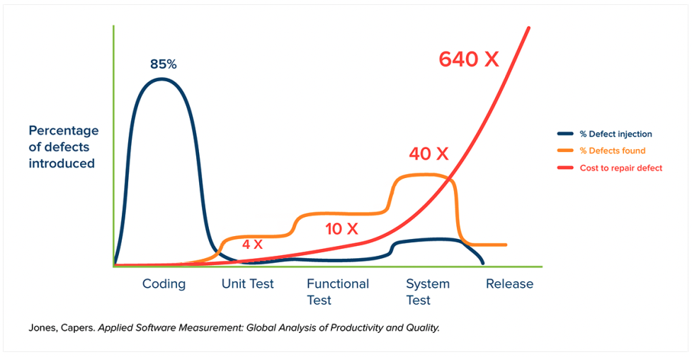

# 테스팅 Fundamental,  애자일 조직에서 QA 엔지니어의 역할

## 테스팅 Fundamental에 대한 이해

### 소프트웨어 테스팅이란?

- 소프트웨어 정상 동작 여부 확인 과정

## 테스팅 Fundamental에 대한 이해

### 소프트웨어 테스팅이란?

- 소프트웨어 정상 동작 여부 확인 과정

### 테스트 레벨에 따른 분류

- 테스트 대상 **소프트웨어의 구현 범위**의 따른 분류
- 유닛 테스트 : function, conponent 자체의 결함 발견
    - 비즈니스 로직 검증
    - 높은 프로그래밍 역량 필요
    - 개발자 수행 (혹은 SDET)
    - 충실도(fidlity)가 높지 않음
- 통합 테스트 : component 간 통합 시 결함 발견
    - 모든 레벨에서 가능
    - 개발자 또는 QA 수행
- 시스템 테스트 : 통합 시스템의 기능/비기능 결함 발견
    - E2E(End to End) 테스트
    - QA 수행 (+ 개발자)
- 인수 테스트 : **고객 요구사항**과의 일치성 확인
    - 인수 조건(Acceptance Criteria)을 만족하는지 확인하는 시스템 테스트
    - 이해 관계자와 데모

### 테스트 유형에 따른 분류

- 발견하려는 결함의 유형에 따른 분류
    - 기능 테스트, 비기능 테스트, 구조/설계 테스트, 변경 테스트
- 모든 테스트 유형은 어느 테스트 레벨에서나 수행할 수 있음

### 테스트 수행 방식에 따른 분류

- 정적 테스트
    - 소프트웨어를 구동하지 않고 리뷰/분석을 통해 결함 발견
    - 리뷰
        - (비즈니스/기능) 요구사항 명세서
        - 디자인 명세
        - 기술 명세
        - 코드
    - 분석/조사
        - 시나리오 분석
        - 영향도 분석
        - 리스크 분석
    - 인스펙션 (Inspection) : 코드를 실행하지 않고 코드 상의 잠재적인 오류를 찾아 개선
- 동적 테스트
    - 대상 소프트웨어를 구동하여 결함 발견
    - 기능 테스트
        - 유닛 테스트
        - 백엔드 서비스 테스트 (ex. API 테스트)
        - 시스템 테스트 (E2E 테스트)
    - 비기능 테스트
        - 성능
        - 보안

### 테스트 설계 기법에 따른 분류

- 테스트 케이스를 도출하는 기법에 따른 분류
    - 명세 기반(Black box), 구조 기반(White box), 경험 기반 기법

## 애자일 개발 조직이 일하는 법, 그 안에서 QA 엔지니어의 역할

### About 애자일

- 공정과 도구보다 **개인과 상호작용**
- 포괄적인 문서보다 **작동하는 소프트웨어**
- 계약 협상보다 **고객과의 협력**
- 계획을 따르기보다 **변화에 대응**

### 애자일하게 개발

- 프로세스 후반에 테스트 하기보다 **프로세스 전반에 걸쳐 테스트 진행**
- 버그를 더 빨리 찾고 예방
- 기능 확인보다 **기획/구현에 대한 이해를 테스트**
- 체계적인(Scripted) 테스팅 보다는 **탐색적(Exploratory) 테스팅**
- 전체 팀 테스트
- Quality Build-up

## 빠른 시장 배포와 품질 사이의 균형

### 소프트웨어 테스팅이란?

- 소프트웨어 정상 동작 여부 확인하여 **내제된 결함을 발견하고, 사용자 기대 수준 만족 여부 확인**

### 테스팅과 생산성은 과연 무슨 관련이 있을까요?

### 애자일 테스터에게 중요한 10가지 원칙

- 끊임없는 피드백 제공
    - PO 나 고객으로 하여금 요구사항들을 예시나 테스트의 형태로 이야기할 수 있도록 도와주는 것
    - 팀원들과 함께 확인된 요구사항을 실행 가능한 테스트로 만듦
- 고객 가치 창출
    - 애자일 개발은 고객이 가장 최근에 중요시하는 기능을 소규모의 릴리즈를 통해 제공하는 것
    - 애자일 테스터는 큰 그림에 집중해야 함 (완성을 목표)
- 직접적인 의사소통
    - 대면을 통한 커뮤니케이션
    - 계속해서 고객이나 기술 팀원을 찾아 토론을 하고 협업 진행
- 용기
    - 처음 애자일을 도입하면 궁금한 점이 많음
        - 짧은 기간에 테스트까지 완료할 수 있는 방법
        - 테스팅과 개발 동시 진행
        - 어느 정도의 테스트가 충분한지 판단하는 기준
    - 위와 같은 질문에 대한 답을 찾을 수 있는 용기를 필요로 함
- 단순함 지향
    - 가능한 단순하게 소프트웨어 구현
    - 고객 요구사항 확인 시 단순한 접근법을 선택
- 지속적인 개선 실행
    - 업무 개선 방안을 찾기 위한 노력
    - 전체 팀이 검토해야 할 테스팅 이슈 제기
    - 더 나은 생산성을 내고 가치를 창출하는 데 도움이 되는 도구와 기술, 새로운 기법 탐색
- 변화에 대응
    - 상위 수준의 테스트 케이스, 비즈니스 만족도 조사, 예제 작성 등을 통한 다음 주기 대응
    - 우선순위 변경 시 시간 낭비 가능성 있음
- 자기 조직화
    - 애자일 팀이 직면한 문제는 팀원 전체의 과제
    - 팀이 자체적인 접근법을 고안하고 실행하는 과정에서 팀원은 테스팅에 대한 새로운 자세를 가지게 됨
- 사람 중심
    - 애자일 팀 구성원은 안정감을 가져야 하며, 서로를 존중하고 개인의 목표의식이 확실
    - 애자일 테스터들은 자신이 팀에서 가지는 고유의 가치를 확실히 인식
- 즐기기
    - 모든 팀원이 유기적으로 협업을 이루고 있음
    - 테스터가 프로젝트 시작부터 끝까지 참여
    - 비즈니스 이해관계자와 개발팀이 함께 일함
    - 모든 팀원들이 품질과 테스팅에 대한 책임감
- 가치를 더하다
    - 시스템의 사용자 관점뿐만 아니라 개발팀이 직면한 기술적인 제약이나 세부 구현 측면도 고려
    - 개발 초기부터 고객과 개발자 모두에게 질문을 던져 올바른 테스트가 수행하여 고객이 만족하는 결과물을 얻을 수 있도록 함
