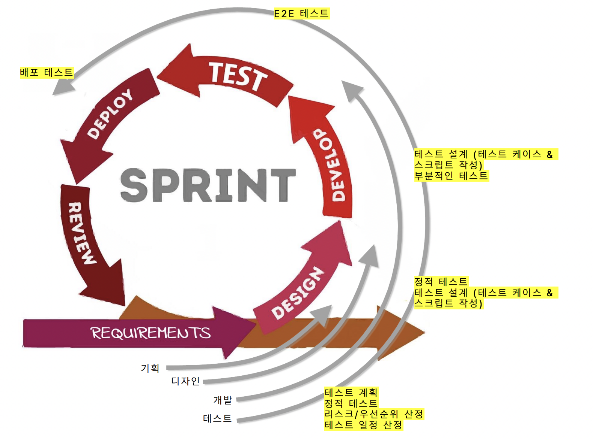

# 스프린트 기반 개발 주기에서 QA 업무

## 애자일 소프트웨어 개발생명주기(SDLC), 테스트생명주기(STLC)

### 애자일 개발 프로세스

- 스크럼 (Scrum)
- 칸반 (Kanban)
- 익스트림 프로그래밍 (Extreme Programming)
- Lean 개발 방법론
- 동적 시스템 개발 방법 (DSDM: Dynamic Systems Development Method)

### 스크럼 기반 프로세스

- 기획 > 디자인 > 개발 > 테스트 > 배포 > 회고
- **기획 단계에서 목표로 설정해둔 내용을 지속적으로 점검 및 테스트 진행**
1. 기획 단계
    - 테스트 아이디에이션(ideation) 단계
    - 정적 테스트 수행, 테스트 플래닝
    - 목적
        - 기획의 모호성, 미비한 점 감소
        - 리스크를 파악하여 잠재적인 위험요소 공유
        - 스프린트 안정성 증진
    - key points
        - 영향 범위 파악 (유저 시나리오)
        - 리스크 분석 (복잡도/테스트 난이도)
        - 우선 순위 선정
        - 테스트 방법 파악, Testability
        - 테스트 일정 산정
2. 디자인 단계
    - 정적 테스트 수행, 테스트 플래닝
    - Testability 확보
    - 테스트 데이터 생성
    - 테스트 타당성 검토 (테스트 스크립트)
    - 테스트 케이스, 테스트 스크립트 작성 시작
    - key points
        - 변경 사항 팔로우업
            - 영향 범위
            - 리스크 분석
            - 우선 순위 재선정
            - 테스트 일정 재산정
3. 개발 단계
    - 본격적인 테스트 케이스, 테스트 스크립트 작업
    - 부분적인 기능 검증 실행
        - API 테스트
        - 테스트 드라이버, 스텁 활용
        - 버그 리포트
    - key points
        - 변경 사항 팔로우업
4. 테스트 단계
    - 시스템 통합 테스트
        - 피쳐 테스트
        - 리그레션 테스트
        - 버그 리포트
        - 수정된 버그 확인 테스트 + 리그레션 테스트
    - 테스트 진행상황 및 버그 상황 공유
        - Bug Triage 세션 (버그 분류 작업)
    - 완료 조건(Definition of Done) 만족 여부 확인
5. 배포 단계
    - 배포 테스트
    - 인수 테스트
6. 리뷰(회고) 단계
    - 버그 회고 (Root Cause Analysis)
    - 테스트 마무리
        - 테스트 산출물 정리
        - 테스트 환경/데이터 정리

## 테스트 설계 : 테스트 케이스와 우선 순위

### 어떻게 테스트할 것인가?

- 테스트 케이스와 테스트 케이스 세트 설계 및 **우선순위 선정**
- 테스트 컨디션과 테스트 케이스에 필요한 테스트 데이터 선별
- **테스트 환경 설계와 필요한 인프라 및 도구 식별**
- 테스트 베이시스, 테스트 컨디션, 테스트 케이스 간의 양방향 추적성 설정

### 우선 순위 선정 기준

- 버그 발생 시의 심각도
- 실제 발생할 가능성
- 수정 비용
- 위의 내용을 종합하여 현재 상황에 맞는 우선 순위 선정

### 테스트 케이스 설계 시의 데이터

- 식별 번호
- 우선 순위
- 분류 (대/중/소분류)
- 요약
- 테스트 데이터
- 사전 조건
- 테스트 스텝
- 기대 결과
- 실제 결과
- 비고

## 테스트 실행 : 전체 시스템을 혹은 작은 부분 부분을!

### 소프트웨어 테스트 엔지니어로써의 조건

- 어플리케이션 클라이언트, API, 서버 간의 동작 원리 이해
- 어플리케이션 클라이언트의 렌더링 원리 (HTML, Javascript, DOM)
- 브라우저 콘솔 창을 이용하여 웹 객체 다루기 (Browser DevTools)
- 어플리케이션 클라이언트와 서버 간의 통신 조회 및 분석 (Browser DevTools, Inspector)
- 어플리케이션 클라이언트와 서버 간 통신 조작 (Fiddler, Charles)
- API 명세서를 보고 endpoint 의 목적과 동작 이해 (Swagger)
- API 엔드 포인트의 요청과 응답 분석 (Browser DevTools, Swagger, Postman, Fiddler, Charles,
  Jmeter)
- API 를 이용하여 원하는 데이터 수집 및 활용 (Swagger, Postman, Fiddler, Jmeter)
- DB 데이터 조회 (DML, T-SQL script, Workbench)

### 테스트를 위한 도구들

- Codeless : 테스트 툴
    - Browser DevTools
    - Inspector
    - Fiddler
    - Charles
    - Selenium IDE
- Low Code : 테스트 툴 + 약간의 코드 작업
    - Postman
    - Jmeter
    - Katalon
- Coded : 프로그래밍 언어와 라이브러리의 활용
    - SQL
    - Python
    - Java
    - Javascript
    - Selenium
    - Playwright
    - Appium

## 버그 보고 : 여러분의 버그 리포트가 여러분을 보여줍니다.

### 버그 보고 시의 데이터

- 제목/요약
- 보고자
- 담당자
- Severity (심각도)
- Priority (우선순위)
- 발생 환경
- 상세 설명
- 재현 경로 (Steps to reproduce)
- 기대 결과 (Expected Result)
- 실제 결과 (Actual Result)
- 참고 문서 (영상, 사진 등)

### 잘 작성된 버그 보고서

- 불필요한 커뮤니케이션 시간 감소
- 원인 분석 시간 단축
- 빠른 버그 수정 유도
- 버그 수정 비용 감소
