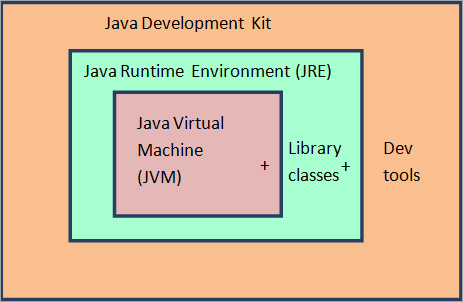
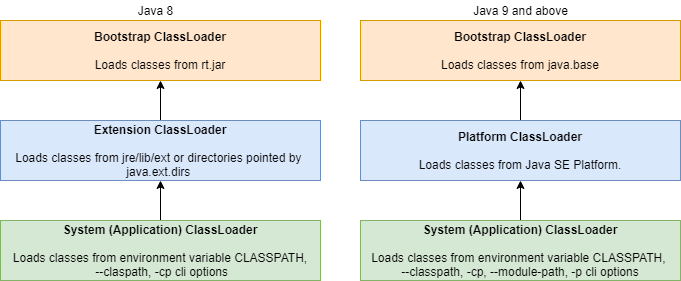

# 1주차 Java의 정의와 동작 방식

## Java 의 정의와 동작 방식

### 순수 객체 지향 언어의 특징

- 추상화, 다형성, 캡슐화, 상속
- 모든 사전 정의 데이터 타입과 사용자 정의 타입은 객체여야 함
- 객체에 대한 모든 작업은 객체 스스로 정해야 함

### Java 가 지키지 못한 순수 객체 지향 언어의 특징

- 원시 타입(Primitive Type)
    - 일반 변수는 공유 가능
- 정적 메서드(Static Method)
    - 인스턴스의 생성 없이 호출 가능
- 래퍼 클래스(Wrapper Class) 또한 Auto Boxing/Unboxing 을 통해 원시 타입 변수 사용
- Java 는 OOP 를 위해 설계되었지만 일부 절차적인 요소가 있는 언어

### Java 아키텍처

- Java 플랫폼
    - SE, EE, ME 등 JDK 를 구현한 제품
    - 일반적으로 Java 개발 및 실행 환경을 의미
    - 흔히 JDK 보다 더 넓은 의미로 사용
- JDK (Java Development Kit)
    - 자바 개발 킷 (JRE + Development Tools)
- JRE (Java Runtime Environment)
    - 자바 실행 환경 (JVM + Library)
- JVM (Java Virtual Machine)
    - 자바 가상 머신 (프로그램 작동)
    - Java 바이트코드를 기계어로 변환하고 실행
- JVM < JRE < JDK

### JDK 구성 요소

### JDK (+ JRE)

- Java 프로그램 실행 및 개발 환경(툴) 제공
- JDK 11 이후 JRE 를 포함
    - OpenJDK 제공 및 일관된 환경 제공을 위해 단순화
    - 기존 JRE 는 JVM, Class Loader, Java Class Libraries, Resource 등 포함
- JDK 9 버전에 도입된 JPMS 로 내부 기능 모듈화
    - JPMS - Java Platform Module System
    - 필요한 모듈만 모아 커스텀 JRE 를 생성하여 메모리, 용량 등 절약
- 참고
    - 모듈은 코드, 데이터를 그룹화하여 재사용이 가능한 정적인 단위
    - 컴포넌트는 독립적으로 실행될 수 있는 소프트웨어 단위

### JVM (Java Virtual Machine)

- 논리적인 개념, 여러 모듈의 결합체
- Java 앱을 실행하는 주체
- JVM 때문에 다양한 플랫폼 위에서 동작 가능
- 대표적인 역할 및 기능
    - 클래스 로딩
    - GC 등 메모리 관리
    - 스레드 관리
    - 예외처리

### JVM Architecture

- Class Loaders
    - 바이트코드 로딩, 검증, 링킹 등 수행
- Runtime Data Areas
    - 앱 실행을 위해 사용되는 JVM 메모리 영역
- Execution Engine
    - 메모리 영역에 있는 데이터를 가져와 해당하는 작업 수행
- JNI (Java Native Interface)
    - JVM 과 네이티브 라이브러리 간 이진 호환성을 위한 인터페이스
    - 네이티브 메서드(네이티브 언어 C/C++ 등으로 작성) 호출, 데이터 전달과 메모리 관리 등 수행
- Native Libraries
    - 네이티브 메서드의 구현체를 포함한 플랫폼별 라이브러리

### Java 동작 방식

- `.java` 로 작성된 코드를 컴파일러가 읽어 `.class` 파일로 컴파일
- JVM 이 읽을 수 있는 바이트코드로 해석

### Class Loaders

- 클래스 로더는 런타임에 Java 클래스/인터페이스의 바이트코드를 동적으로 메모리에 로딩
    - 한 번에 모든 클래스가 메모리에 로드되는 것이 아닌 필요할 때마다 로드
- 로딩 작업은 크게 3가지로 분류
    - Loading : JVM 이 필요한 클래스 파일 로드
    - Linking : 로드된 클래스의 verify, prepare, resolve 작업 수행
    - Initializing : 클래스/정적 변수 등 초기화

### JVM Runtime Data Areas

- The pc Register
    - 스레드 별로 생성되며 실행중인 명령(오프셋)을 저장하는 영역
- Java Virtual Machine Stacks (Stack Area, Java Stack)
    - 스레드 별로 생성되며 메서드 실행 관련 정보를 저장하는 영역 (프레임 저장)
- Heap
    - JVM 실행 시 생성되며 모든 객체 인스턴스/배열에 대한 메모리가 할당되는 영역
- Method Area
    - JVM 실행 시 생성되며 클래스의 구조나 정보를 저장하는 영역
- Native Method Stacks
    - 스레드 별로 생성되며 네이티브 코드 실행에 관련 정보를 저장하는 영역

### Execution Engine

- **JVM 메모리 영역에 있는 바이트코드를 읽어 네이티브 코드로 변환하고 실행**
    - Interpreter
        - 메모리에 로드된 바이트코드를 한줄씩 해석 및 실행
    - JIT(Just-In-Time) Compiler
        - 자주 호출되는 메서드(hot method) 의 바이트코드를 네이티브 코드로 컴파일
        - JVM 이 실행 메서드를 모니터, JIT 컴파일러의 프로파일러가 수집한 프로파일 정보를 기반으로 처리
        - 중간 코드 생성 > 코드 최적화 > 네이티브 코드 생성
    - GC (Garbage Collector)
        - 메모리에서 사용하지 않는 개체를 식별해 삭제하는 프로세스 (대표적으로 Heap 영역)
        - 데몬 스레드로 동작 (명시적으로 호출해도 즉시 실행되지 않음)
- 필요한 경우 JNI 를 통해 네이티브 메서드 라이브러리를 호출

### JNI (Java Native Inteface)

- 네이티브 라이브러리 사용을 위한 인터페이스이자 동시에 해당 역할을 수행 (일종의 프레임워크)
- JNI 를 통해 JVM 내 Java 코드는 네이티브 언어/라이브러리와 상호 운용될 수 있음
    - JNI 는 Java VM 에 의존적이지 않아 다른 부분에 영향을 주지 않고 JNI 에 대해 추가 가능

### Native Method Libraries

- 네이티브 언어/어셈블리와 같은 언어로 작성된 네이티브 메서드를 포함한 라이브러리
- JVM 에서 호출할 때 JNI 를 통해 로딩

### 컴파일러와 인터프리터

- 컴파일러 (Compile 방식)
    - 프로그래밍 언어로 작성된 코드를 타겟 언어로 변환(번역)하는 프로그램
    - 주로 High-Level 언어를 Low-Level 언어(assembly, object code, machine code 등)로 변환
        - 또한 **전처리와 어휘/구문/의미 분석, 코드 최적화(optimization), 기계어 생성 등의 역할도 수행**
- 인터프리터 (Interpret 방식)
    - 읽은 코드 및 해당 명령을 직접 분석/실행하는 프로그램
    - 인터프리터 전략
        1. 코드 구문을 분석, 동작을 직접 수행
        2. 코드를 object code (중간 코드)로 변환, 즉시 실행
        3. 컴파일러에 의해 생성된 바이트코드를 명시적으로 실행
    - Java 는 2번과 3번의 혼합

### Java 코드 실행 방식

- Java 는 두 가지 방식을 혼합하여 사용하는 하이브리드 모델
    - javac 로 소스코드를 바이트코드(object code)로 변환
    - 변환된 바이트코드를 JVM 인터프리터가 분석 및 실행
- 일반적으로 javac 를 통해 컴파일하는 과정이 있으므로 컴파일 언어로 분류하기도 함

### Java 동작 방식 정리

- `.java` 파일 컴파일하여 `.class` 파일 형태로 컴파일
- JVM 이 실행되면 바이트코드 실행에 필요한 것들을 클래스 로더가 로딩
    - JVM 이 해석할 수 있는 바이트코드로 변환
    - JVM Runtime Data Area 의 Method Area 에 저장 (메타데이터)
        - 클래스의 구조, 메서드 등
- 실행 준비가 모두 완료되면 JVM 은 메인 메서드(Entry point) 를 호출
- 호출된 메인 메서드를 실행할 메인 스레드가 생성되며 메인 스레드의 JVM stacks 가 생성됨
- 그 후 생성된 메인 스레드 JVM stacks 에 메인 메서드 스택 프레임이 생성됨
- 이후 앱이 실행되며 필요한 시점마다 필요한 처리를 수행하며 메모리 확보 및 데이터 저장
- 해당 클래스가 호출될 경우 Method Area 에 클래스 정보를 읽음
    - JVM Execution Engine 의 Interpreter 가 바이트코드를 해석과 동시에 바로 실행
    - 자주 호출되는 메서드가 있을 경우 JIT Compiler 가 미리 네이티브 코드로 변환
- 읽은 정보를 해석하여 Thread 관련 처리
    - Thread 에 대한 정보는 PC Register 에서 관리
    - 클래스를 호출한 메서드는 Stack Area 에서 관리
        - Thread 별 메서드 하나당 하나의 Stack 생성하여 독립적으로 관리
    - 바이트코드로 저장되어 있는 코드를 네이티브 코드로 해석하여 Native Method Stack 에서 실행
        - Thread 별로 생성
- 해석한 정보를 토대로 JVM Heap Area 에 클래스의 인스턴스 저장

## 클래스 로더와 클래스 로딩

### Class Loaders

- 런타임에 Java Byatecode 를 JVM 메모리로 동적 로딩
    - 실행하기 전에 모든 클래스를 읽어와 바이트코드로 변환 후 미리 저장
    - Loading (Creating)
    - Linking (Verification, Preparation, Resolution)
    - Initialization
- 필요할 때마다 필요한 클래스/리소스만 로딩
- 클래스 로더는 계층 구조로 이루어짐

- 부트스트랩 클래스 로더 (Bootstrap Class Loader)
    - 최상위 클래스 로더이자 네이티브 코드로 작성된 클래스 로더(JVM 이 로딩)로 base 모듈 로딩
        - 따라서 JVM 에 따라 부트스트랩 클래스 로더의 구현이 다를 수 있음
    - 다른 Java 클래스의 로딩을 담당하는 `**java.lang.ClassLoader` 를 로드하는 클래스 로더**
    - JDK 9 버전부터 `jre/lib/rt.jar` 가 없어짐에 따라 내부 클래스들은 lib 디렉터리에 저장
- 플랫폼 클래스 로더 (Platform Class Loader)
    - Java SE Platform 의 모든 API/클래스 로딩
    - 플랫폼 클래스 로더 또는 상위 클래스로 정의된 JDK 런타임 클래스
    - JDK 9 버전부터 `jre/lib/ext`, `java.ext.dirs` 미지원 (일부 메커니즘 변경)
        - 그 전 버전까지 확장 메커니즘이 존재
        - 클래스 패스에 별다른 네이밍 없이도 확장 클래스를 로딩
        - 확장 디렉터리에서 코드를 로딩
- 시스템 클래스 로더 (System Class Loader)
    - Java 앱 레벨의 클래스 로딩
        - 클래스 패스, 모듈 패스에 있는 클래스로딩 (-classpath, -cp 등 환경 변수 옵션 포함)

### Class Loaders 원칙 (Principle)

- 위임 (Delegation Model)
    - 클래스/리소스 등을 자신이 찾기 전에 먼저 상위 클래스 로더에게 위임
        - 그 전에 이미 로딩되어 있다면 위임하지 않고 반환
    - 상위 클래스 로더가 해당 클래스/리소스를 찾지 못하면 요청한 클래스 로더가 찾아서 로딩 (반복)
- 유일성 (Unique Classes)
    - 상위 클래스 로더가 로딩한 클래스를 하위 클래스 로더가 다시 로딩하는 것을 방지
    - Delegation 원칙으로 인해 클래스의 유일성을 확보하기 쉬움
- 가시성 (Visibility)
    - 하위 클래스 로더는 상위 클래스 로더가 로딩한 클래스를 볼 수 있음
    - 하지만 반대로 상위 클래스 로더는 하위 클래스 로더가 로딩한 클래스를 볼 수 없음

### 좋은 클래스 로더의 속성

- 클래스명이 같다면 클래스 로더는 항상 같은 클래스 객체를 반환
- 하위 클래스 로더가 상위 클래스 로더에게 특정 클래스 로딩을 위임한 경우
    - 두 클래스 로더는 해당 클래스에 대해 동일한 객체를 반환해야 함
        - 관련된 슈퍼클래스, 필드타입, 생성자 파라미터, 메서드 반환 타입 등 포함
- 사용자 정의 클래스 로더가 클래스 바이너리를 미리 가져올 때 (Prefetching)
    - 로딩 에러가 발생할 가능성이 있더라도 미리 가져올 때가 아닌 `적시` 에 발생해야 하며 이런 경우 실제 사용 여부 판단이 선행되어야 함
- 다음과 같은 경우 Prefetching 은 JVM 구현 방식에 따라 가능
    - 사용 빈도가 높다고 예상되거나 복잡한 종속성이 있다고 판단되는 경우
    - 해당 클래스와 관련된 클래스 그룹을 같이 로딩하는 경우 (그룹 로딩)

### Class Loaders 의 예시

### Loading

- 특정 이름(FQCN) 을 가진 클래스(인터페이스 등)의 바이트코드를 찾아 클래스를 만드는 프로세스

- 최하위 클래스 로더부터 클래스를 찾음
    - `java.lang.ClassLoader` 의 생성자, 하위 클래스를 사용해서 새 클래스 로더의 상위 지정 가능
        - 명시적으로 상위 클래스 로더를 지정하지 않으면 JVM 의 System 클래스 로더로 지정됨
    - FQCN(Fully Qualified Class Name) 을 기반으로 로딩된 클래스인지 찾음
        - 상위 클래스 로더에서 로딩하는 클래스와 이름이 같아도 FQCN 이 다르기 때문에 다른 클래스로 인식
        - 만약 상위 클래스와 FQCN 까지 같다면 충돌 발생
- `java.lang.ClassLoader` 의 loadClass 메서드를 통해 클래스 로딩 수행 (배열 클래스는 JVM 이 생성)
    - 이미 로딩된 클래스가 있다면 이를 반환
    - 해당 클래스가 로딩되지 않았다면 이를 바로 로딩하지 않고 상위 클래스 로더에게 위임
        - 최상위 클래스 로더까지 반복
    - 상위 클래스 로더가 로드하지 못했다면 findClass 메서드를 호출해 클래스 로딩
        - 상위 클래스 로더가 null 또는 ClassNotFoundException 예외를 발생한 경우
    - 클래스가 로딩될 때 Runtime constant Pool 도 같이 생성
    - 클래스 로더에 의해 생성된 객체가 참조하는 클래스를 로딩할 때도 같은 메커니즘
- 상위 클래스 또한 해당 클래스를 찾지 못한다면 하위 클래스가 찾아서 로딩
    - 최상위 클래스 로더까지 로드에 실패하면 NoClassDefFoundError 또는 ClassNotFoundException 발생

### ClassNotFoundException vs NoClassDefFountError

- ClassNotFoundException
    - FQCN 을 통해 클래스 로딩 시 클래스 패스에서 해당 클래스를 찾을 수 없는 경우 발생
    - 일반적으로 클래스명 등을 통해 리플렉션할 때 발생
        - Class.forName, ClassLoader.loadClass, ClassLoader.findSystemClass 등
- NoClassDefFoundError
    - new 키워드 또는 팩터리 메서드 등을 통한 객체를 로드할 때 발생
    - 일반적으로 static 블록 실행이나 static 변수 초기화 시 예외가 발생한 상황에서 에러 발생
- 위의 문제를 막기 위해 신경써야 할 점
    - 해당 파일의 존재 유무
    - 올바른 클래스 패스 설정 여부
    - 해당 클래스를 로딩하는 클래스 로더

### Linking

- 로딩된 클래스를 클래스(인터페이스 등)을 실행하기 위해서 결합(연결)하는 프로세스
    - 검증(Verification), 정적 필드 준비(Preparation), 심볼릭 레퍼런스 처리(Resolution)

- 바이트코드를 결합해 실행할 수 있도록 하는 프로세스
- 로딩된 바이트코드의 유효성을 검증 (Verification)
- 선언된 static field 를 초기화, 필요한 메모리 할당 (Preparation)
- 심볼릭 레퍼런스를 실제 참조, 프로세스 등으로 변환 (Resolution)
- 심볼릭 레퍼런스의 검증은 링킹보다 나중에 처리될 수 있음
- 링킹은 새로운 자료구조의 할당을 포함하기 때문에 OutOfMemoryError 가 발생할 수 있음

### Linking 활성화 조건

- 클래스/인터페이스는 `링킹` 되기 전에 완전히 `로딩` 되어야 함
- 클래스/인터페이스는 `초기화` 되기 전에 완전히 `검증` 되어야 함
- 링킹 중 감지된 오류는 관련 클래스/인터페이스의 링킹이 직간접적으로 필요한 지점에서 발생해야 함
- 심볼릭 레퍼런스는 실제 참조될 때까지 확인되지 않음 (일종의 Lazy Loading)
    - 동적으로 계산되는 상수의 심볼릭 레퍼런스도 부트스트랩 메서드가 호출할 때까지 확인되지 않음

### Symbolic Reference

- Java 바이트코드에서 클래스/인터페이스/필드 등 참조하는 다른 요소를 표현하는 방식
- JVM 구현에 따라 심볼릭 레퍼런스가 Lazy 가 아닌 Eager 로 확인/연결될 수 있음
    - 이때 발생하는 오류는 직간접적으로 참조(사용)하는 지점에서 발생해야 함
- 클래스가 로딩 후 링킹(Resolution) 되는 시점에서 심볼릭 레퍼런스가 실제 주소값으로 대체됨
- 일반적인 예시 (간접적인 표현)
    - `java.lang.String` 클래스의 `private final char[] value` 필드
        - `Ljava/lang/String;.value:[C`
            - `L` → 참조 타입 (클래스/인터페이스)
            - `;` → 클래스와 필드의 구분자 (일반적으로 생략)
            - `.value` → 필드명
            - `:` → 참조
            - `[` → 배열 표현 (2차원이라면 `[[`)
            - `C` → `char` 타입
    - `java.lang.String` 클래스의 `public char charAt(int index)` 메서드
        - `Ljava/lang/String;.charAt:(I)C`
            - `(I)` → 메서드의 파라미터 타입
            - `C` → 메서드의 반환 타입

### Linking - Verification

- Binary Representation (Java Bytecode) 의 유효성을 검사하는 프로세스
    - 이때 관련 클래스(인터페이스)가 로딩될 수 있지만 이 클래스가 꼭 검증, 준비될 필요는 없음
        - 이는 JVM 구현 방식에 따라 다름
- 클래스/인터페이스 바이트코드가 유효하지 않은 경우 이 시점에서 VerifyError 가 발생해야 함
- 검증 중에 LinkageError 가 발생하면 이후 검증 시에는 항상 동일한 에러로 실패해야 함

### Linking - Preparation

- 클래스/인터페이스의 static field 생성 및 필요한 메모리를 할당하며 기본값으로 초기화하는 프로세스
    - 예를 들어 static int 타입은 0, 객체 참조는 null 로 초기화
        - static field 의 값 초기화(바인딩)는 다음 작업인 초기화(Initialization) 과정의 일부
    - 인스턴스 필드는 객체의 인스턴스화 과정에서 초기화, 메모리 할당
- 이때 런타임 상수 풀(Runtime Constant Pool) 도 메서드 영역(Method Area) 에 할당됨

### Runtime Constant Pool

- 클래스/인터페이스가 로딩될 때 메서드 영역(Method Area) 에 할당되는 자료구조
    - 컴파일 시 `.class` 파일에 생성되는 일반 상수 풀의 런타임 표현
- 일반 상수 풀의 데이터를 기반으로 생성되며 스태틱 상수와 심볼릭 레퍼런스(또는 실제 참조) 등을 포함
    - 상수 뿐만 아니라 메서드, 필드 참조까지 여러 종류의 상수가 포함됨
- 일반 프로그래밍 언어의 심볼 테이블과 유사하지만 그보다 더 넓은 범위의 데이터를 포함함
    - 심볼 테이블은 컴파일러/인터프리터가 프로그램을 분석/처리 시 사용하는 자료구조이며 코드의 식별자/상수/프로시저/함수 등과 관련된 정보를 저장함
- Method Area 영역에 허용 가능한 메모리를 초과하면 OutOfMemoryError 발생

### Linking - Resolution

- 심볼릭 레퍼런스가 구체적인 값을 가리키도록 동적으로 결정하는 프로세스
    - JVM 의 많은 명령들이 런타임 상수 풀의 심볼릭 레퍼런스에 의존
    - 처음부터 많은 심볼릭 레퍼런스가 확인/검증되지는 않음
- 심볼릭 레퍼런스에 대한 동적 계산(실제 주소값으로 변경)은 아래 규칙을 준수하며 수행
    - 해당 작업을 수행하는 동안 오류가 발생하지 않음
    - 후속 시도는 초기 시도와 동일한 결과를 만듦
- 이 과정에서 아래와 같은 에러가 발생한다면 심볼릭 레퍼런스를 직간접적으로 사용하는 지점에서 발생해야 함
    - IncompatibleClassChangeError (클래스 정의가 컴파일과 런타임에 따라 다를 때 발생)
    - 부트스트랩 메서드로 인한 에러
    - 클래스 로더 제약 조건 위반으로 발생한 LinkageError
