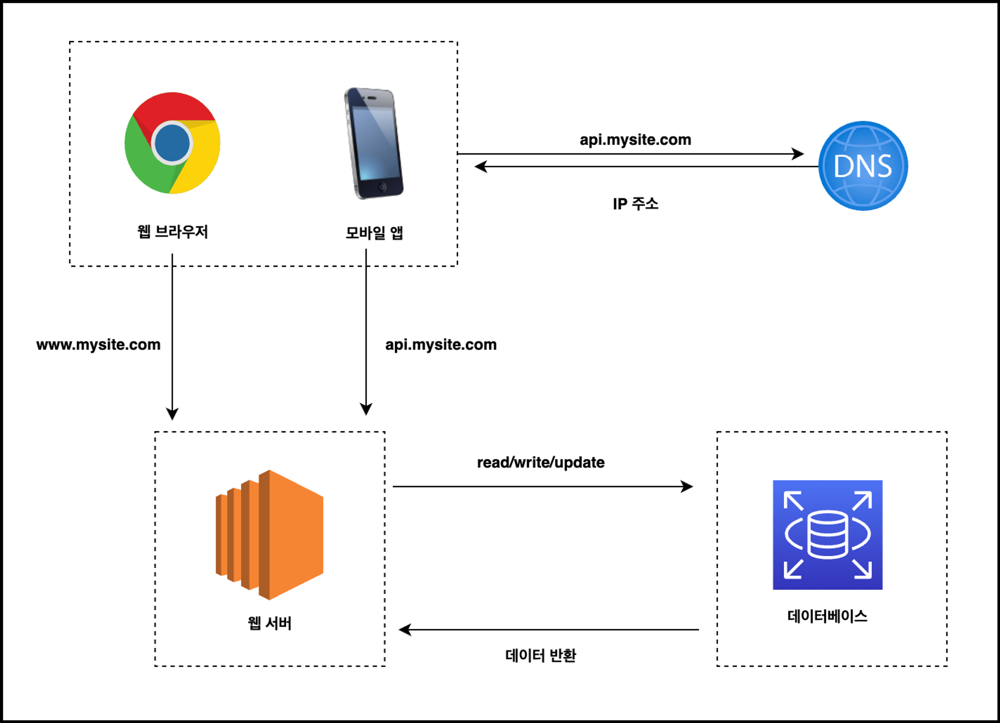
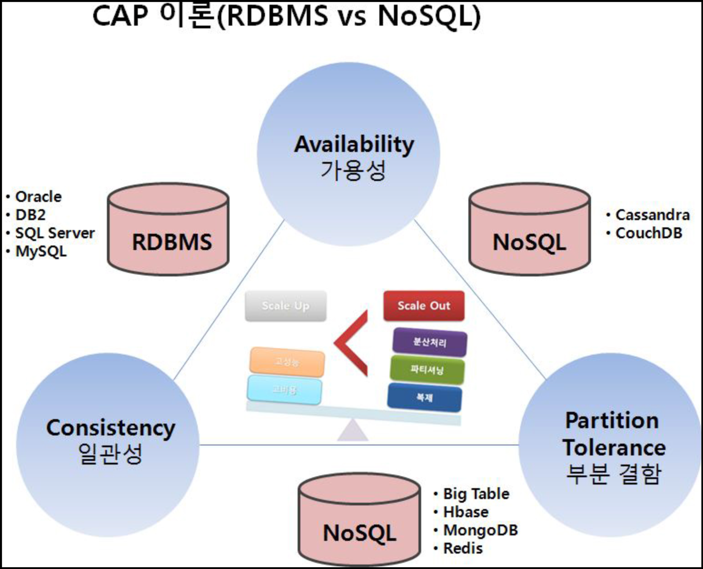
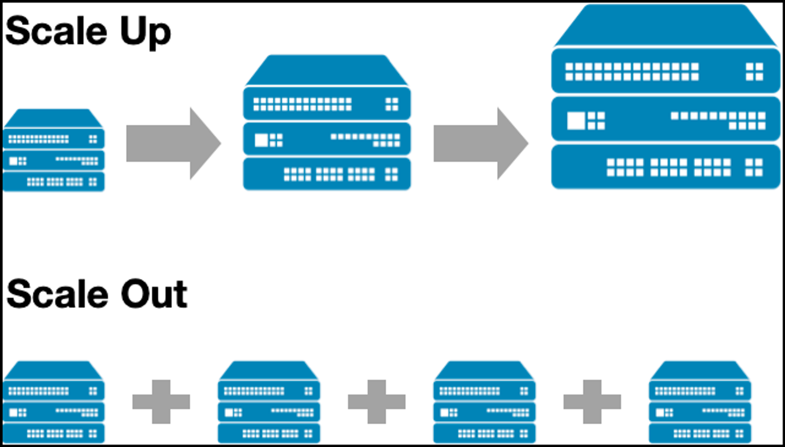

# 웹 서버, 데이터베이스, 수평적 확장, 수직적 확장

## ****기술 면접에서 시스템 설계 문제가 가지는 의미****

### 도서 추천

- 가상 면접 사례로 배우는 대규모 시스템 설계 기초
- 데이터 중심 어플리케이션 설계
- 마이크로서비스 패턴

## 가장 기초적인 단일 서버를 설계 해보자

## 어떤 데이터베이스를 사용하지? : RDBMS vs NoSQL

### CAP 이론 요소

- `일관성(Consistency)` : 모든 노드가 동일한 데이터 보유
- `가용성(Availability)` : 모든 노드가 모든 요청에 대해 정상적인 응답 처리
- `부분 결함(Partition Tolerance)` : 분산된 특정 노드에 장애가 발생하더라도 데이터 사용 가능
    - 가용성과 일관성은 분산 시스템의 특성이지만 부분 결함은 네트워크의 특성
    - CAP 이론은 세 가지 모두 분산 시스템의 특성으로 취급

### RDBMS: 관계형 데이터 베이스

- MySQL, Oracle DB, PostgreSQL 등
- 자료를 열과 컬럼으로 표현
- 조인을 사용하여 여러 관계 병합

### NoSQL: 비관계형 데이터 베이스

- MongoDB, DynamoDB, Cassandra 등
- 키-값 저장소, 그래프 저장소, 칼럼 저장소, 문서 저장소 등으로 구분
- 조인을 지원하지 않음

## 규모를 확장해보자 : 수직적 확장 vs 수평적 확장

### 수직적 확장 (Scale Up)

- 서버의 사양을 높이며 규모 확장
- 한 대의 서버에 CPU, Memory 등 자원을 무한히 증설하는 방법은 없음
- 비용 증가 폭이 큰 편
- 반드시 사양을 높인다고 그 만큼의 부하 처리가 좋아지는 것은 아님

### 수평적 확장 (Scale Out)

- 서버의 개수를 늘리며 규모 확장
