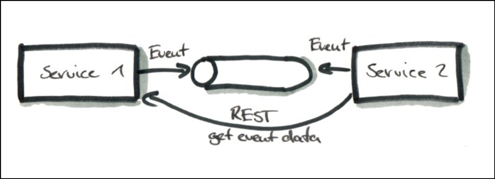
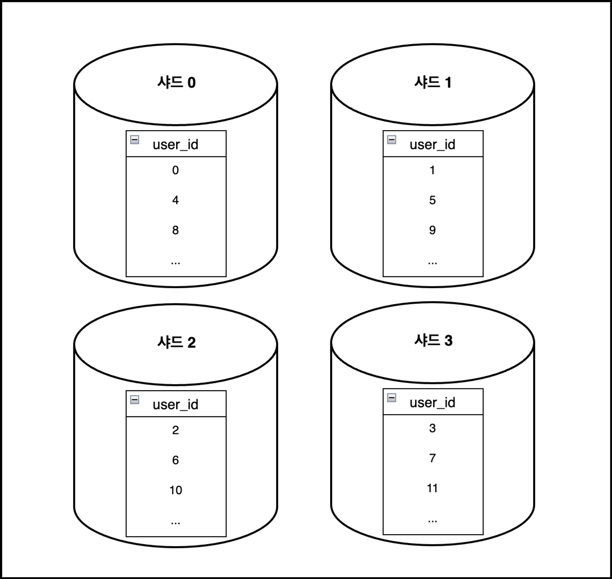
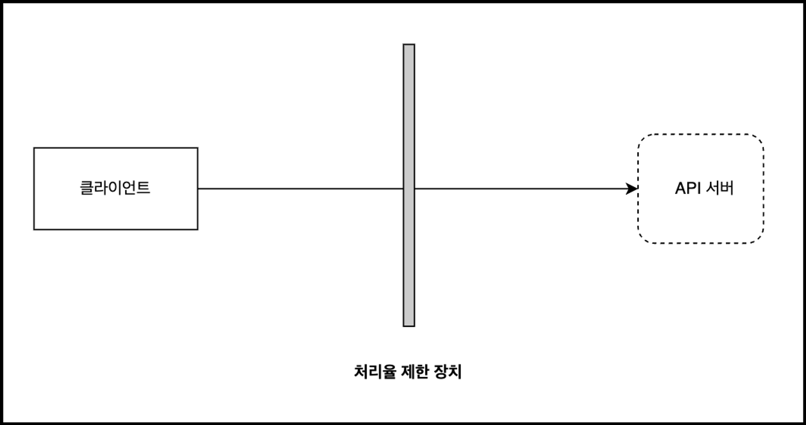

# 메시지 큐, 샤딩, 처리율 제한

# 메시지 큐를 사용하여 비동기 통신을 해보자

## 메시지 큐

- 메시지 큐에 보관된 메시지는 소비자(Consumer) 가 꺼낼 때까지 안전히 보관된다는 특성을 보장하는 비동기 통신 매체
- 메시지 큐를 활용하면 서비스 또는 서버 간의 결합이 느슨해져, 규모 확장성이 보장되어야 하는 안정적 어플리케이션을 구성할 수 있음
- 생산자(Producer) 는 소비자(Consumer) 프로세스가 다운되어도 메시지를 발행할 수 있고, 그 반대도 가능
- 알림 푸쉬 발송, 이메일 발송, 이미지 보정 등 시간이 오래 걸릴 수 있는 프로세스를 비동기적으로 처리

## 이벤트 큐

- 메시지 큐와는 달리 한 번 읽은 데이터가 즉시 삭제되지 않음
- 현대 어플리케이션에서는 이벤트 기반 마이크로서비스 아키텍처를 구현할 때 많이 활용

### 특징

- 단일 진실 공급원
- 장애가 일어난 시점부터 재처리가 가능
- 많은 양의 실시간 데이터를 효율적으로 처리 가능

### 유튜브 영상

- [카프카, 레빗엠큐, 레디스 큐의 큰 차이점! 이벤트 브로커와 메시지 브로커에 대해 알아봅시다.](https://www.youtube.com/watch?v=H_DaPyUOeTo&ab_channel=%EB%8D%B0%EB%B8%8C%EC%9B%90%EC%98%81DVWY)
- [카프카 산전수전 노하우](https://tv.kakao.com/channel/3150758/cliplink/391419257)

## 이벤트 기반 마이크로 서비스

- 현대 Event Driven MSA 에서는 시스템 이벤트를 생성/소비하는 방식으로 서로 통신
- 이벤트를 소비해도 전달한 시스템에서 바로 사라지지 않고 다른 컨슈머도 가져갈 수 있게 보존

## DDD 와 Bounded Context

- Bounded Context 를 비즈니스 중심으로 설계하면 팀별로 느슨하게 결합하여 고도로 응집된 MSA 를 할 수 있음
- 덕분에 비즈니스에 필요한 솔루션을 자율적으로 설계/구현 가능
- 팀 간의 복잡한 의존 관계가 줄어듬
- 만약 기술 중심으로 설계하면 모놀리식 시스템과 같은 문제를 겪게됨

### 유튜브 영상

- [[2019] DDD Lite@Spring](https://www.youtube.com/watch?v=TdyOH1xZpT8&ab_channel=NHNCloud)

## 이벤트 기반 통신 구조

- 요청과 응답 API 에 얽매이는 일 없이 이벤트 스트림 내부에 정의된 이벤트 데이터를 매개로 소통
- Producer 는 자신이 맡은 이벤트 스트림에 잘 정의된 데이터를 생산하는 일만 책임
- Consumer 는 이벤트 스트림에서 들어온 데이터를 처리하는 일을 담당
- 느슨한 결합과 높은 응집도를 추구하는 Bounded Context 원칙을 더 확실히 준수함

## 동기식 마이크로서비스의 문제점

1. 점대점 결합 : 다른 서비스에 의존
2. 의존적 확장 : 의존하는 다른 모든 서비스가 확장이 가능한지 고려해야 함
3. API 버저닝 : API 스펙을 변경하는 것이 매우 어려움
4. 테스트 : 의존하는 서비스까지 통합해서 테스트하기 어려움

### 유튜브 영상

- [11번가 Spring Cloud 기반 MSA로의 전환 - 지난 1년간의 이야기](https://www.youtube.com/watch?v=J-VP0WFEQsY&ab_channel=NAVERD2)

## 비즈니스 토폴로지

- (마이크로서비스 + 이벤트 스트림 + API) 의 집합
- 마이크로서비스는 비즈니스 Bounded Context 를 구현함
- 이벤트 스트림은 전체 Context 의 도메인 데이터를 공유하기 위해 필요한 데이터 통신 수단

## Microservice Communication Patterns 정리

- [원문](https://reflectoring.io/microservice-communication-patterns/)

### Synchronous Calls

- 구현하기 가장 쉬운 Communication Pattern
- 서비스1은 서비스2가 요청 처리를 완료하고 응답을 반환할 때까지 대기
- 동기식이기 때문에 구조가 간단하여 구현하기 쉬움
- Nexflix 의 Feign 그리고 Hystrix (Circuit Breaker) 를 사용할 수 있음
- 서비스1이 서비스2로 요청을 보내고, 서비스2가 요청 처리 도중 서비스1에서 timeout 예외가 발생한다면 두 서비스 간에 데이터가 일치하지 않을 수 있음
- 동기 서비스 간에는 강한 결합을 생성함

### Simple Messaging

- 서비스1은 메시지 브로커에게 메시지만 보냄
- 서비스2는 메시지 브로커로부터 메시지를 구독하기만 하면 됨
- 서비스1, 서비스2는 서로의 존재를 알 필요가 없음
- 메시지 브로커를 기준으로 페이로드가 포함된 메시지를 서로 주고 받기만 함
- 메시지 브로커 라이브러리에 따라 Retry 기능이 제공
- 서비스2가 사용이 불가능한 상태일 때, 서비스2가 정상화 될때까지 메시지 전달 시도
    - 서비스2가 polling 하는 구조라면 고려할 필요 없음
- 서비스2는 서비스1을 호출하지 않기 때문에 느슨한 결합을 유지할 수 있음
- 메시지 브로커에 문제가 발생하면 안됨
- 메시지 브로커에 데이터가 중앙 집권화되기 때문에 hell will break loose 할 것임
- 메시지 구조가 변경된 경우 모든 클라이언트가 변경된 메시지 구조를 처리할 수 있어야 함
    - 이는 마이크로서비스의 주요 목표 중 하나인 independent deployments (독립 배포) 와는 모순됨
    - 하휘 호환성이 보장되게 변경하는 것으로 완화할 수 있음
- 서비스1, 서비스2를 서로 같은 트랜잭션으로 묶고 싶다면 Two-Phase Commit 을 사용
    - 데이터베이스나 메시지 브로커가 지원하지 않을 수 있으며 좋은 성능을 기대하기 어려움
    - 거의 사용하지 않음

### 유튜브 영상

- [프로그래밍 초식 : DB 트랜잭션 조금 이해하기 01](https://www.youtube.com/watch?v=urpF7jwVNWs&ab_channel=%EC%B5%9C%EB%B2%94%EA%B7%A0)

### Transactional Messaging

- 메시지를 브로커에 전달하기 전에 데이터베이스에 저장하는 방식
- 수신자는 메시지를 송신하고 처리하기 전에 데이터베이스에 저장
- 메시지를 보내는 쪽과 받는 쪽의 로컬 데이터베이스에 저장하기 때문에 언제든 롤백, 복구가 가능
- 데이터베이스에 메시지가 저장되기 때문에 브로커에 장애가 나더라도 데이터베이스에서 메시지를 조회하면 됨
- 아키텍처를 구성하기에는 다소 복잡
    - 발생해야 하는 메시지를 데이터베이스에 저장해야 하기 때문
    - 데이터베이스로부터 데이터를 polling 하고 처리되지 않은 메시지에 대한 처리 로직을 작성해야 함
        - 송신측 : 메시지 브로커로 전송
        - 수신측 : 메시지를 처리하는 비즈니스 로직 호출

### 유튜브 영상

- [[NHN FORWARD 22] 분산 시스템에서 데이터를 전달하는 효율적인 방법](https://www.youtube.com/watch?v=uk5fRLUsBfk&ab_channel=NHNCloud)

### Zero-Payload Events

- 페이로드에 대한 포인터만 메시지로 전달
    - Order ID = 4711 주문이 배송되었다는 메시지를 발행한다고 가정
    - 서비스1은 메시지에 EventType = orderShipped 그리고 Order ID = 4711 만 포함해서 브로커에 전달
    - 수신자는 송신자를 호출해서 주문 데이터를 요청
- 메시지 구조가 정말 심플하기 때문에 하위 호환성에 대한 고려를 할 필요가 없음
- 메시지 브로커에 장애가 발생해도 재시도를 할 수 있음
    - 페이로드는 서비스1을 호출해서 얻기 때문
- 이벤트 페이로드를 얻기 위해 서비스 간에 동기적인 호출 필요
    - 서비스 복잡도 상승

### 유튜브 영상

- [[우아콘2020] 배달의민족 마이크로서비스 여행기](https://www.youtube.com/watch?v=BnS6343GTkY&ab_channel=%EC%9A%B0%EC%95%84%ED%95%9C%ED%85%8C%ED%81%AC)

# 데이터베이스 규모를 확장해보자

## 샤딩

- 데이터베이스를 수평적 확장 (scale out) 하는 것을 의미
- 더 많은 서버를 추가하여 성능을 향상시킬 수 있음

- 샤딩은 대규모 데이터베이스를 샤드라고 부는 작은 단위로 분할하는 것을 의미함
- 모든 샤드는 같은 스키마를 쓰지만 샤드에 보관되는 데이터 사이에는 중복이 없음

  

- 여러 샤드에 걸친 데이터를 조인하기 매우 어려움
- 핫스팟 키 문제 : 특정 샤드에 쿼리가 집중될 수 있음
- 데이터 재샤딩이 어려움

### 블로그 글

- [데이터베이스 파티셔닝과 샤딩](https://hudi.blog/db-partitioning-and-sharding/)

# 트래픽을 제어하는 방법에 대하여 공부해보자

## 처리율 제한

- 클라이언트 또는 서비스가 보내는 트래픽의 처리율을 제어하기 위한 장치
- 특정 임계치(Threshold) 를 넘으면 그 이후의 요청은 중단
- 만약 제 3 사업자가 제공하는 API Gateway 를 사용한다면 선택지는 제한될 수 있음
- MSA 에 기반하고 있다면 인증, IP 허용같은 기능을 이미 API Gateway 에 적용했을 수 있음
    - 처리율 제한도 같이 포함하면 좋음
- 충분한 인력이 없다면 상용 솔류션도 권장
- 예시
    - 사용자는 초당 2회 이상 새 글을 올릴 수 없음
    - 같은 IP 주소로는 하루에 10개 이상의 계정을 생성할 수 없음
    - 같은 디바이스로는 주당 5회 이상 리워드를 요청할 수 없음

### 설계

- 클라이언트 측
    - 위변조가 가능하여 권장하지 않음
- 서버측

  

- 미들웨어

  

- MSA 인 경우 처리율 제한 장치는 보통 API Gateway 에 구현
    - API Gateway : 처리율 제한, SSL 종단, 사용자 인증, IP 허용 목록 관리 등

### 블로그 글

- [[MSA] spring boot에서 resilience4j 사용해보자 - RateLimiter, BulkHead, TimeLimiter 편](https://sabarada.tistory.com/206)

### 토큰 버킷 알고리즘

- 토큰이 주기적으로 채워짐
- 각 요청이 처리될 때마다 하나의 토큰 사용
- 토큰이 없다면 해당 요청은 버려짐
- 많은 기업들이 보편적으로 사용하는 알고리즘 (AWS 등)
- 통상적으로 API 엔드포인트마다 별도의 버킬을 둠
- IP 주소별로 처리율 제한을 적용해야 한다면 IP 주소마다 버킷을 하나씩 할당해야 함
- 시스템의 처리율을 초당 10,000 개 요청으로 제한한다면, 모든 요청이 하나의 버킷을 공유하도록 해야 함
- 구현이 쉬우며 메모리 효율적임
- 짧은 시간에 집중되는 트래픽에 대한 처리도 가능
- 버킷 크기 & 토큰 공급률 두 개의 인자를 필요로 하는 알고리즘이기 때문에 적절하게 튜닝하기 어려움
