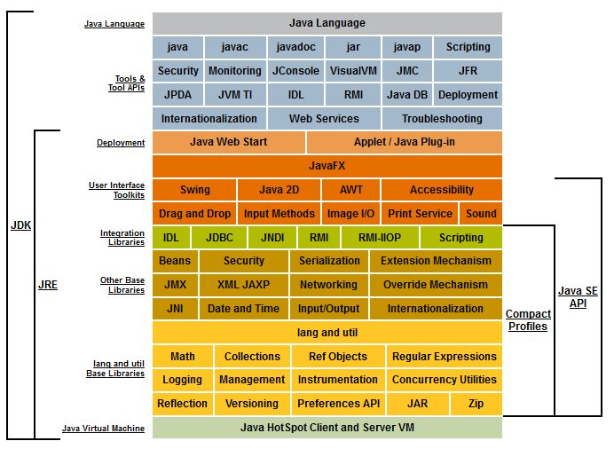
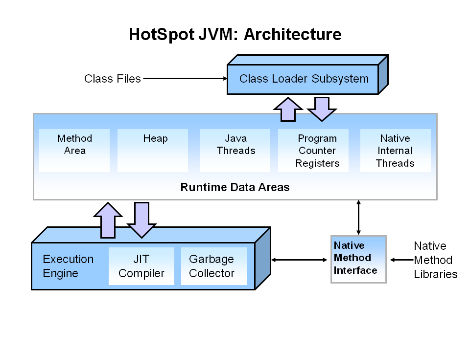
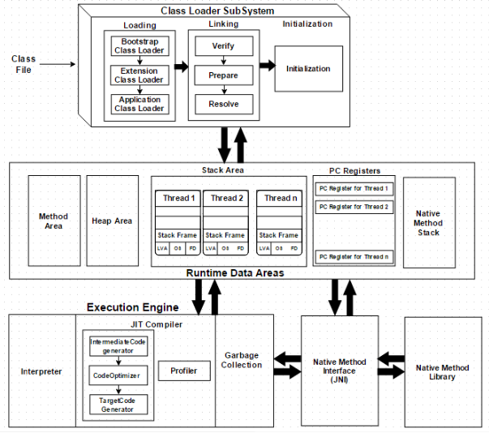
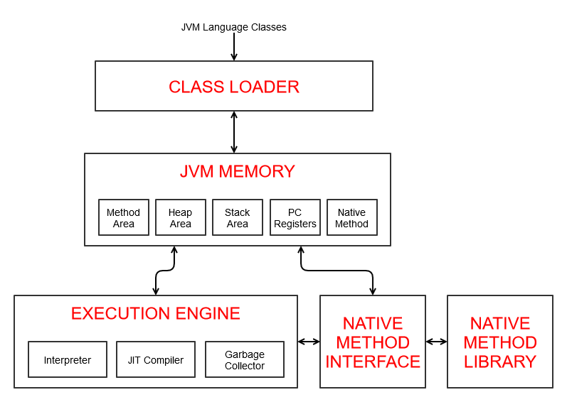
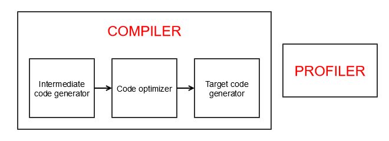
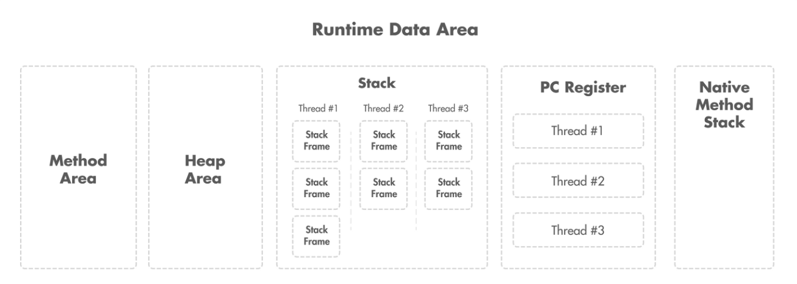

# 1주차 Java의 정의와 동작 방식

## Java 의 정의와 동작 방식

### 순수 객체 지향 언어의 특징

- 추상화, 다형성, 캡슐화, 상속
- 모든 사전 정의 데이터 타입과 사용자 정의 타입은 객체여야 함
- 객체에 대한 모든 작업은 객체 스스로 정해야 함

### Java 가 지키지 못한 순수 객체 지향 언어의 특징

- 원시 타입(Primitive Type)
    - 일반 변수는 공유 가능
- 정적 메서드(Static Method)
    - 인스턴스의 생성 없이 호출 가능
- 래퍼 클래스(Wrapper Class) 또한 Auto Boxing/Unboxing 을 통해 원시 타입 변수 사용
- Java 는 OOP 를 위해 설계되었지만 일부 절차적인 요소가 있는 언어

### Java 아키텍처

- Java 플랫폼
    - SE, EE, ME 등 JDK 를 구현한 제품
    - 일반적으로 Java 개발 및 실행 환경을 의미
    - 흔히 JDK 보다 더 넓은 의미로 사용
- JDK (Java Development Kit)
    - 자바 개발 킷 (JRE + Development Tools)
- JRE (Java Runtime Environment)
    - 자바 실행 환경 (JVM + Library)
- JVM (Java Virtual Machine)
    - 자바 가상 머신 (프로그램 작동)
    - Java 바이트코드를 기계어로 변환하고 실행
- JVM < JRE < JDK

### JDK 구성 요소

### JDK (+ JRE)

- Java 프로그램 실행 및 개발 환경(툴) 제공
- JDK 11 이후 JRE 를 포함
    - OpenJDK 제공 및 일관된 환경 제공을 위해 단순화
    - 기존 JRE 는 JVM, Class Loader, Java Class Libraries, Resource 등 포함
- JDK 9 버전에 도입된 JPMS 로 내부 기능 모듈화
    - JPMS - Java Platform Module System
    - 필요한 모듈만 모아 커스텀 JRE 를 생성하여 메모리, 용량 등 절약
- 참고
    - 모듈은 코드, 데이터를 그룹화하여 재사용이 가능한 정적인 단위
    - 컴포넌트는 독립적으로 실행될 수 있는 소프트웨어 단위

### JVM (Java Virtual Machine)

- 논리적인 개념, 여러 모듈의 결합체
- Java 앱을 실행하는 주체
- JVM 때문에 다양한 플랫폼 위에서 동작 가능
- 대표적인 역할 및 기능
    - 클래스 로딩
    - GC 등 메모리 관리
    - 스레드 관리
    - 예외처리

### JVM Architecture

- Class Loaders
    - 바이트코드 로딩, 검증, 링킹 등 수행
- Runtime Data Areas
    - 앱 실행을 위해 사용되는 JVM 메모리 영역
- Execution Engine
    - 메모리 영역에 있는 데이터를 가져와 해당하는 작업 수행
- JNI (Java Native Interface)
    - JVM 과 네이티브 라이브러리 간 이진 호환성을 위한 인터페이스
    - 네이티브 메서드(네이티브 언어 C/C++ 등으로 작성) 호출, 데이터 전달과 메모리 관리 등 수행
- Native Libraries
    - 네이티브 메서드의 구현체를 포함한 플랫폼별 라이브러리

### Java 동작 방식

- `.java` 로 작성된 코드를 컴파일러가 읽어 `.class` 파일로 컴파일
- JVM 이 읽을 수 있는 바이트코드로 해석

### Class Loaders

- 클래스 로더는 런타임에 Java 클래스/인터페이스의 바이트코드를 동적으로 메모리에 로딩
    - 한 번에 모든 클래스가 메모리에 로드되는 것이 앙닌 필요할 때마다 로드
- 로딩 작업은 크게 3가지로 분류
    - Loading : JVM 이 필요한 클래스 파일 로드
    - Linking : 로드된 클래스의 verify, prepare, resolve 작업 수행
    - Initializing : 클래스/정적 변수 등 초기화

### JVM Runtime Data Areas

- The pc Register
    - 스레드 별로 생성되며 실행중인 명령(오프셋)을 저장하는 영역
- Java Virtual Machine Stacks (Stack Area, Java Stack)
    - 스레드 별로 생성되며 메서드 실행 관련 정보를 저장하는 영역 (프레임 저장)
- Heap
    - JVM 실행 시 생성되며 모든 객체 인스턴스/배열에 대한 메모리가 할당되는 영역
- Method Area
    - JVM 실행 시 생성되며 클래스의 구조나 정보를 저장하는 영역
- Native Method Stacks
    - 스레드 별로 생성되며 네이티브 코드 실행에 관련 정보를 저장하는 영역

### Execution Engine

- **JVM 메모리 영역에 있는 바이트코드를 읽어 네이티브 코드로 변환하고 실행**
    - Interpreter
        - 메모리에 로드된 바이트코드를 한줄씩 해석 및 실행
    - JIT(Just-In-Time) Compiler
        - 자주 호출되는 메서드(hot method) 의 바이트코드를 네이티브 코드로 컴파일
        - JVM 이 실행 메서드를 모니터, JIT 컴파일러의 프로파일러가 수집한 프로파일 정보를 기반으로 처리
        - 중간 코드 생성 > 코드 최적화 > 네이티브 코드 생성
    - GC (Garbage Collector)
        - 메모리에서 사용하지 않는 개체를 식별해 삭제하는 프로세스 (대표적으로 Heap 영역)
        - 데몬 스레드로 동작 (명시적으로 호출해도 즉시 실행되지 않음)
- 필요한 경우 JNI 를 통해 네이티브 메서드 라이브러리를 호출

### JNI (Java Native Inteface)

- 네이티브 라이브러리 사용을 위한 인터페이스이자 동시에 해당 역할을 수행 (일종의 프레임워크)
- JNI 를 통해 JVM 내 Java 코드는 네이티브 언어/라이브러리와 상호 운용될 수 있음
    - JNI 는 Java VM 에 의존적이지 않아 다른 부분에 영향을 주지 않고 JNI 에 대해 추가 가능

### Native Method Libraries

- 네이티브 언어/어셈블리와 같은 언어로 작성된 네이티브 메서드를 포함한 라이브러리
- JVM 에서 호출할 때 JNI 를 통해 로딩

### 컴파일러와 인터프리터

- 컴파일러 (Compile 방식)
    - 프로그래밍 언어로 작성된 코드를 타겟 언어로 변환(번역)하는 프로그램
    - 주로 High-Level 언어를 Low-Level 언어(assembly, object code, machine code 등)로 변환
        - 또한 **전처리와 어휘/구문/의미 분석, 코드 최적화(optimization), 기계어 생성 등의 역할도 수행**
- 인터프리터 (Interpret 방식)
    - 읽은 코드 및 해당 명령을 직접 분석/실행하는 프로그램
    - 인터프리터 전략
        1. 코드 구문을 분석, 동작을 직접 수행
        2. 코드를 object code (중간 코드)로 변환, 즉시 실행
        3. 컴파일러에 의해 생성된 바이트코드를 명시적으로 실행
    - Java 는 2번과 3번의 혼합

### Java 코드 실행 방식

- Java 는 두 가지 방식을 혼합하여 사용하는 하이브리드 모델
    - javac 로 소스코드를 바이트코드(object code)로 변환
    - 변환된 바이트코드를 JVM 인터프리터가 분석 및 실행
- 일반적으로 javac 를 통해 컴파일하는 과정이 있으므로 컴파일 언어로 분류하기도 함

### Java 동작 방식 정리

1. 작성한 소스파일(`.java`) 을 Java 컴파일러(javac) 가 바이트코드(`.class`) 로 변환
2. JVM 이 실행되면 바이트코드 실행에 필요한 것들을 클래스 로더가 로딩
    1. 메모리에 로딩된 클래스의 구조, 메서드 등 일련 정보들을 JVM 내부에 저장
3. 로딩된 클래스의 바이트코드를 JVM 의 실행 엔진이 해석 및 실행
    1. 인터프리터를 통해 해석과 동시에 실행
    2. 추후에 자주 사용되는 메서드 등을 JIT 컴파일러를 통해 네이티브 코드로 변환
4. 실행 준비가 모두 완료되면 JVM 은 메인 메서드(Entry point) 를 호출
5. 호출된 메인 메서드를 실행할 메인 스레드가 생성되며 메인 스레드의 JVM stacks 이 생성됨
6. 그 후 생성된 메인 스레드 JVM Stacks 에 메인 메서드 스택 프레임이 생성됨
7. 이후 앱이 실행되며 필요한 시점마다 필요한 처리를 수행하며 메모리 확보 및 데이터 저장
    1. 클래스, 메서드 정보를 Method Area 에 저장
    2. Heap 에 해당 인스턴스 할당
    3. Frame 생성
    4. JNI 스택 생성
8. JVM 은 실행되는 Java 앱에 대해서 메모리, 스레드 등 관리
